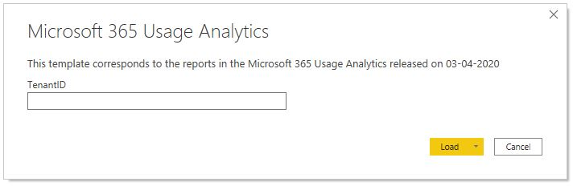
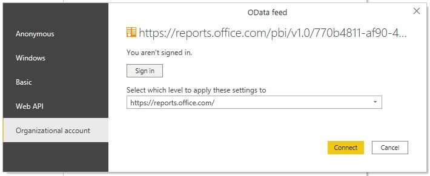
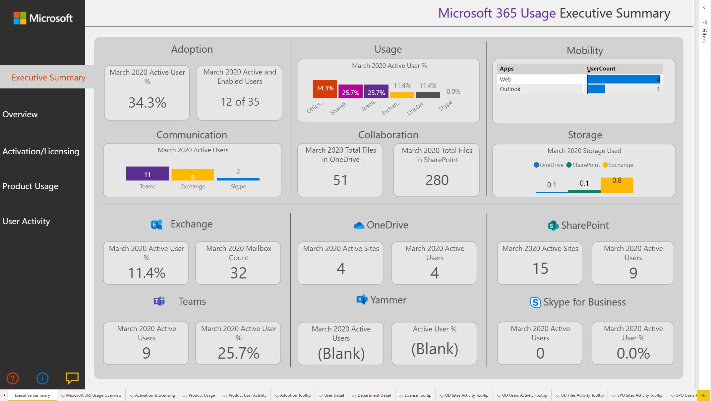
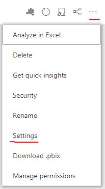
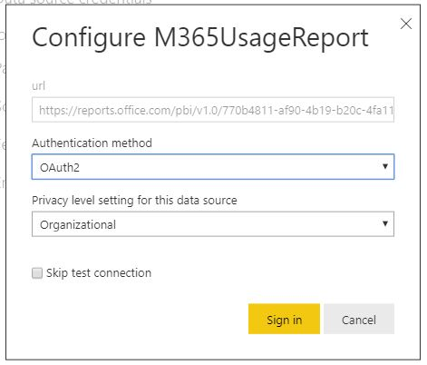
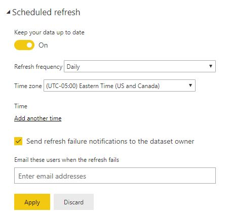

# Manually Creating M365 Usage Reports for Power BI

## Whitelisting for Power BI in GCC/GCC High
If you are running in GCC/GCC High, you first need to makes sure your Power BI service has been whitelisted.  You will not be able to sign in with Power BI Desktop or use the Power BI Data Gateway until this is completed.

More details in the link below.

https://docs.microsoft.com/en-us/power-bi/service-govus-signup#additional-signup-information

## Enabling Microsoft 365 Usage Analytics
You need to make sure the usage analytics are enabled for your tenant.  Details can be found below,

https://docs.microsoft.com/en-us/microsoft-365/admin/usage-analytics/enable-usage-analytics?view=o365-worldwide

## Determine your O365 Tenant ID
You will need to know your O365 tenant ID to get this report up and running.  Details around how you can get this are below.

https://docs.microsoft.com/en-us/onedrive/find-your-office-365-tenant-id

In commerical O365, you can go to the Admin Azure Active Directory portal here,

https://aad.portal.azure.com/#blade/Microsoft_AAD_IAM/ActiveDirectoryMenuBlade/Properties

In Azure for Government (GCC/GCC High) you can go to the Admin Azure Active Directory portal here,

https://portal.azure.us/#blade/Microsoft_AAD_IAM/ActiveDirectoryMenuBlade/Overview

## Downloading the Template File
The template file for Microsoft 365 Usage Report can be found below,

https://docs.microsoft.com/en-US/microsoft-365/admin/usage-analytics/usage-analytics?WT.mc_id=365AdminCSH&view=o365-worldwide#how-can-i-get-the-pbit-file-that-this-dashboard-is-associated-with

Download the file and open it.  This will prompt you to input your O365 tenant ID.

 Once you do this, you will then get prompted to sign in.  Make sure you choose an Organizational Account and sign in with the O365 identity associated with your Power BI environment.

Make sure you sign in here with the same O365/AAD identity.

You will now see a populated M365 report in Power BI Desktop

## Publishing the Report
Now publish the report from Power BI Desktop to your Power BI Service.  Once published, you also need to configure the data source and setup a scheduled refresh.

Go to the dataset settings associated with the newly published report.

Make sure the credentials are properly configured.  You need to make sure you are using OAuth credentials to refresh this dataset.

Also, make sure a scheduled refresh is configured to make sure the data is properly updated in the Power BI report.

You are now good to go to share this report with anyone in your organization to view/analyze the M365 usage across your tenant.

