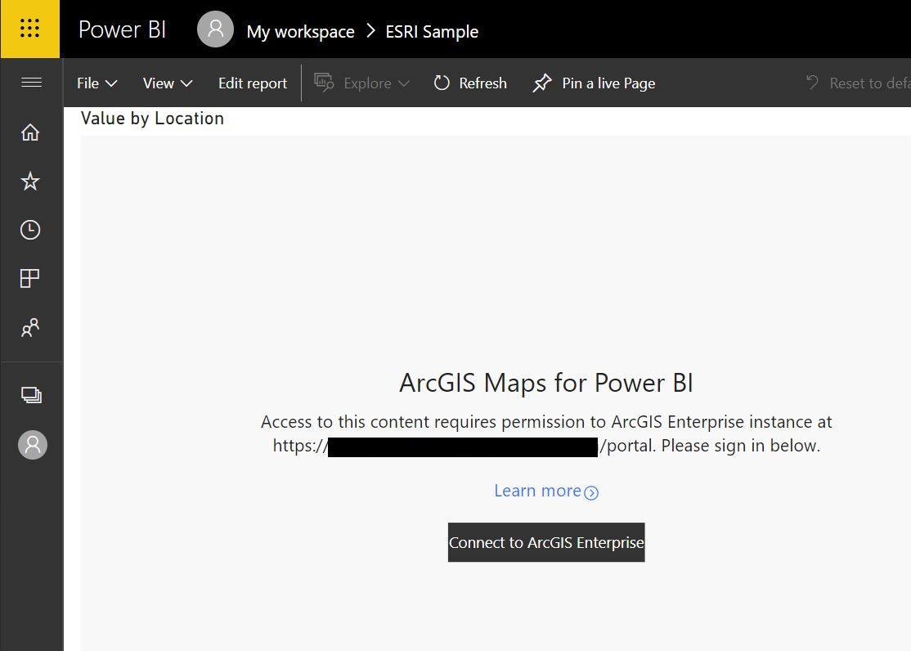

# Integrating ArcGIS Enterprise
This write up describes how to integrate ESRI ArcGIS Enterpise with Power BI.

## Requirements
* ESRI ArcGIS Enterprise Server that is accessible to the end users that will consume Power BI reports
* Will not work when ESRI ArcGIS Enterprise is setup with IWA and PKI/Smartcard authentication
* To date (1/27/2020) this only works with Power BI Desktop (Nov 2019 release or later) and Power BI the service in O365.  This does not work with Power BI Report Server

## Additional Documentation
[Supported Environments ESRI Docs](https://doc.arcgis.com/en/maps-for-powerbi/get-started/supported-env.htm)

## Creating the Demo with Power BI Desktop
First you need to get the URL of your ESRI ArcGIS Enterprise environment.  The URL you need to use with Power BI will end with "/portal".  For example "https://arcgis.contoso.com/portal".

Open up Power BI Desktop (not Power BI Desktop for Report Server).  In the ribbon click on "Enter Data". Create a simple table like below,

Next, add the ArcGIS visual to your report,

Edit the visual to add your organizations ArcGIS Enterprise URL (the one that ends with portal).

Click on the arrow next to the URL.  You will be prompted for your ArcGIS Enterprise credentials.

You should now see the two sample data points rendering in the ArcGIS visual as below,

## Publishing the Report to Power BI Service
Once you publish the report to the Power BI Service in O365, the report will look like this below,

Click on the "Connect to ArcGIS Enterprise" to sign in.

After you sign in successfully your report will look like this,

