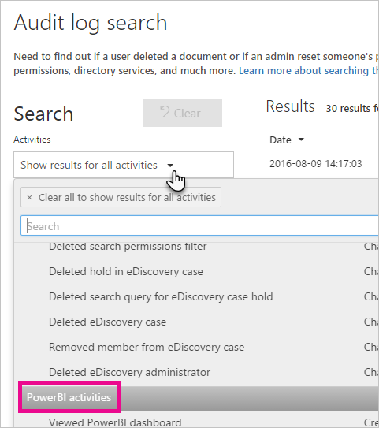
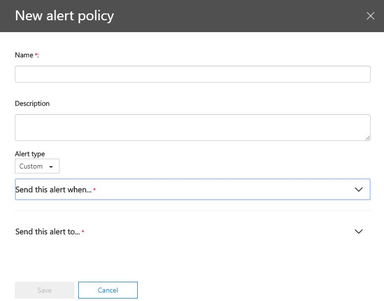
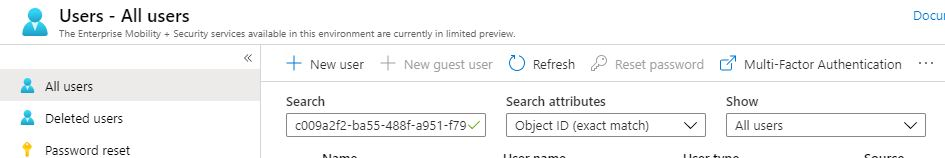

# Power BI Audit Log Analysis

In order to view and analyze the Power BI audit logs in O365, you first need to make sure auditing is enabled for your O365 tenant.

https://docs.microsoft.com/en-us/power-bi/service-admin-auditing#use-the-audit-log


## Analyzing Audits via the Unified Audit Log UI
The O365 Audit Logs URL is different based on the cloud environment you are using,

|Environment|URL|
|---|---|
|Commerical|https://protection.office.com/unifiedauditlog|
|GCC|https://protection.office.com/unifiedauditlog|
|GCC High|https://scc.office365.us/unifiedauditlog|

If you go to the link above for your environment, you can manually search for Power BI events.  



If you want to setup an automated alert anytime one of your filters triggers, you can create a new alert policy in the UI,



User information will show up with a ObjectUserID.  If you want to lookup the user information, go to the Azure portal,

|Environment|URL|
|---|---|
|Commercial|https://portal.azure.com|
|GCC|https://portal.azure.com|
|GCC High / GCC DoD|https://portal.azure.us|

Once in the Azure Portal, go to the Azure Active Directory blade.

Then go to Users.  Then search for the ObjectUserID in the search box.  Make sure to change the Search Attributes drop down to "Object ID (exact match).



## PowerShell
You can also search the audit logs via PowerShell.  You need one module installed to do this.

````
# Run this in an Administrator session of PowerShell
Install-Module -Name AzureAD
````

To connect to O365 you need to use the Exchange Online remote PowerShell module,
````
# Set the user credentials
$userCredential = Get-Credential

# Set the Environment URL (only use one of these for your actual environment)

# Commercial / GCC
$environmentUrl = "https://outlook.office365.com/powershell-liveid/"

# GCC High
$environmentUrl = "https://outlook.office365.us/powershell-liveid"

# GCC DoD
$environmentUrl = "https://webmail.apps.mil/powershell-liveid/"

# Setup the session
$Session = New-PSSession -ConfigurationName Microsoft.Exchange -ConnectionUri $environmentUrl -Credential $UserCredential -Authentication Basic -AllowRedirection

# Import the session
Import-PSSession $Session -DisableNameChecking
````

Now you can use the Search-UnifiedAuditLog commandlet to your O365 environment and filter to all Power BI activities

````
# Note: RecordType 20 is the filter for Power BI activities
Search-UnifiedAuditLog -StartDate 3/1/2020 -EndDate 3/10/2020 -RecordType 20 -Formatted
````

## Filtering for Access Changes
A common question customers want to answer is have any of my Power BI Workspaces' access changed recently?  This will only cover the new V2 Workspaces and Apps in Power BI.

For new V2 workspaces, you have the following Actiivty Types available,

|Activity Type|Activity Description|
|---|---|
|UpdateFolder|Updated Power BI folder|
|UpdateFolderAccess|Updated Power BI folder access|
|CreateFolder|Created Power BI folder|
|DeleteFolder|Deleted Power BI folder|

There are also the same types of activity types for Apps (ie when you publish a workspace as an app)

|Activity Type|Activity Description|
|---|---|
|CreateApp|Created Power BI app|
|UpdateApp|Updated Power BI app|

If you want to view recent Workspace access changes you can query via PowerShell with this sample example,

````
# StartDate and EndDate are required.  Make sure to change this for your specific date range
Search-UnifiedAuditLog -StartDate 3/1/2020 -EndDate 3/10/2020 -RecordType 20 -Operations "*Folder*" -Formatted
````

This would yield sample results like below,

````
RunspaceId   : cb1ee2dc-983c-446c-9cfa-4267175dea42
RecordType   : PowerBIAudit
CreationDate : 3/3/2020 2:58:11 AM
UserIds      : john@contoso.onmicrosoft.com
Operations   : UpdateFolderAccess
AuditData    : {
                 "Id": "e1e9ae76-0266-4002-8cfa-70fd2d23e59c",
                 "RecordType": "PowerBIAudit",
                 "CreationTime": "2020-03-03T02:58:11",
                 "Operation": "UpdateFolderAccess",
                 "OrganizationId": "79d8c44b-ee77-444b-bd81-f855d8040a69",
                 "UserType": "Regular",
                 "UserKey": "10030000A8DBA471",
                 "Workload": "PowerBI",
                 "UserId": "john@contoso.onmicrosoft.com",
                 "ClientIP": "95.20.144.123",
                 "UserAgent": "Mozilla/5.0 (Windows NT 10.0; Win64; x64) AppleWebKit/537.36 (KHTML, like Gecko)
               Chrome/80.0.3987.122 Safari/537.36",
                 "Activity": "UpdateFolderAccess",
                 "IsSuccess": true,
                 "FolderObjectId": "c3f9c058-dc84-409c-b050-c97e567b4bb6",
                 "FolderDisplayName": "Johns's Test V2 Workspace",
                 "FolderAccessRequests": [
                   {
                     "RolePermissions": "ReadReshareExplore",
                     "UserObjectId": "14fa6fa9-dfd3-4b0f-ad79-29309e3f37b2"
                   }
                 ],
                 "RequestId": "4c911fda-9269-e4af-2445-a4b1c4a60d41",
                 "ActivityId": "e54052a9-de1a-4553-8c07-0bb8bcae38aa"
               }
ResultIndex  : 2
ResultCount  : 2
Identity     : e1e9ae76-0266-4002-8cfa-70fd2d23e59c
IsValid      : True
ObjectState  : Unchanged
````

If you look at the FolderAccessRequests section you can see the UserObjectId associated with the access granted.  

Now if you wanted to explored details around this user, you can use the AzureAD PowerShell module to view the users information,

````
# First you need to connect to AzureAD
# Commercial or GCC Mod
Connect-AzureAD

# GCC High / GCC DoD
Connect-AzureAD -AzureEnvironmentName AzureUSGovernment

# Query the Azure AD for the UserObjectID
Get-AzureADUser -ObjectId 14fa6fa9-dfd3-4b0f-ad79-29309e3f37b2
````

Now you can view the details of the AzureAD properties for the user,

````
ObjectId                             DisplayName   UserPrincipalName                       UserType
--------                             -----------   -----------------                       --------
14fa6fa9-dfd3-4b0f-ad79-29309e3f37b2 John Doe      john@contoso.onmicrosoft.com            Member
````