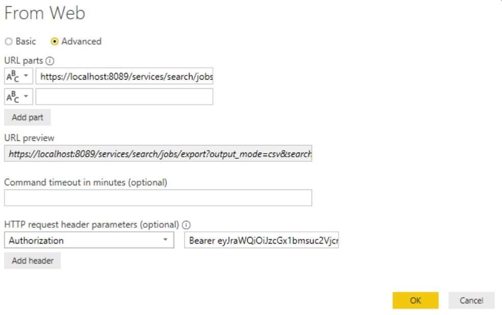

# Visualizing Splunk Data with Power BI
Power BI can consume and visualize search result data from Splunk.  To do this, you need to leverage the Splunk REST API.  

## Splunk Setup
[Splunk REST API Docs](http://dev.splunk.com/restapi)

The Splunk REST API allows you to authenitcate with JWT tokens by passing it in as an Authorization header in the HTTP request,

[Using Tokens with Splunk REST API](https://docs.splunk.com/Documentation/Splunk/latest/RESTUM/RESTusing#Direct_endpoint_access_with_valid_Splunk_authentication_tokens)

To get this working, you first need to enable tokens in the Splunk REST APIs.

[Enable tokens with Splunk](https://docs.splunk.com/Documentation/Splunk/7.3.0/Security/EnableTokenAuth#Enable_token_authentication_for_a_Splunk_platform_instance)

Then, you need to create a token.  Details on this are below,

[Create tokens for Splunk](https://docs.splunk.com/Documentation/Splunk/7.3.0/Security/EnableTokenAuth#Create.2C_use.2C_manage.2C_and_delete_tokens)

Now that you have your token setup, you can now make a call to the search export endpoint for the Splunk API to export a search.

```
GET https://<splunk_rest_url>:8089/services/search/jobs/export?output_mode=csv&search=search source="tutorialdata.zip:*" clientip="87.194.216.51" | stats count by host HTTP/1.1
Authorization: Bearer <Splunk JWT Token>
```

Note that the search query string paramater must start with the "search" value.  

## Get Splunk Data from Power BI
Putting this altogether, you can now use the Power BI web connector to make a REST call to the Splunk API.

1. Go to Get Data > Web.
2. Check the Advanced option.
3. Paste the Splunk REST call you would like to make.  For example,
```
https://<splunk_rest_url>:8089/services/search/jobs/export?output_mode=csv&search=search source="tutorialdata.zip:*" clientip="87.194.216.51" | stats count by host
```
4. At the bottom you can specify HTTP headers.  Set the Authorization header to `Bearer <Token>`
5. Your web connection should look like the screenshot below,



Now you should be able to import the results and start visualizing the data.

