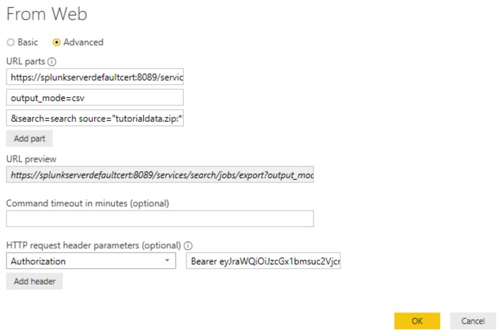

# Visualizing Splunk Data with Power BI
Short link to this page => https://aka.ms/pbi-splunk

Power BI can consume and visualize search result data from Splunk.  To do this, you need to leverage the Splunk REST API.  

## Software Versions
This has been tested with the following software versions,

* Power BI Desktop September 2019 release
* Splunk Enterprise 7.3.2
* Windows Server 2019

## Installing Splunk for Test Purposes
For development purposes, you can download a 60 day trial of Splunk Enterprise [here](https://www.splunk.com/en_us/download/splunk-enterprise.html).  After the 60 days expire, you will need to uninstall your environment and reinstall the trial software.

Don't follow theses steps for a production scenario!

Once installed, you also need to ensure that your machine trusts the self signed cert that Splunk uses with the default installation.  

* Navigate to the Splunk Admin site (https://localhost:8089).
* You will get a warning about the site not being secure
* Go to the site anyways
* Click on the certificate details and install both the root certificate (SplunkCommonCA) and the self signed certificate (SplunkServerDefaultCert) to the Local Computer's Trusted Root Certification Authorities path
* Add an entry to the hosts file (C:\Windows\System32\drivers\etc\hosts) to map 127.0.0.1 to SplunkServerDefaultCert.  The hosts file should look like the sample file below,

```
# Copyright (c) 1993-2009 Microsoft Corp.
#
# This is a sample HOSTS file used by Microsoft TCP/IP for Windows.
#
# This file contains the mappings of IP addresses to host names. Each
# entry should be kept on an individual line. The IP address should
# be placed in the first column followed by the corresponding host name.
# The IP address and the host name should be separated by at least one
# space.
#
# Additionally, comments (such as these) may be inserted on individual
# lines or following the machine name denoted by a '#' symbol.
#
# For example:
#
#      102.54.94.97     rhino.acme.com          # source server
#       38.25.63.10     x.acme.com              # x client host

# localhost name resolution is handled within DNS itself.
#	127.0.0.1       localhost
#	::1             localhost
127.0.0.1	SplunkServerDefaultCert
```

* You can now access the REST endpoint with a trusted certificate by going to https://SplunkServerDefaultCert:8089 locally on the machine

## Loading Sample Data
For this write up, I used the tutorial data files from Splunks documentation site.  Below are instructions on how to upload those files to your test Splunk instance,

[Upload the tutorial data](https://docs.splunk.com/Documentation/Splunk/7.3.0/SearchTutorial/GetthetutorialdataintoSplunk)

## Splunk REST API Setup
The Splunk REST API documentation is below,

[Splunk REST API Docs](http://dev.splunk.com/restapi)

The Splunk REST API allows you to authenitcate with JWT tokens by passing it in as an Authorization header in the HTTP request,

[Using Tokens with Splunk REST API](https://docs.splunk.com/Documentation/Splunk/latest/RESTUM/RESTusing#Direct_endpoint_access_with_valid_Splunk_authentication_tokens)

To get this working, you first need to enable tokens in the Splunk REST APIs.

[Enable tokens with Splunk](https://docs.splunk.com/Documentation/Splunk/7.3.0/Security/EnableTokenAuth#Enable_token_authentication_for_a_Splunk_platform_instance)

Then, you need to create a token.  Details on this are below,

[Create tokens for Splunk](https://docs.splunk.com/Documentation/Splunk/7.3.0/Security/EnableTokenAuth#Create.2C_use.2C_manage.2C_and_delete_tokens)

Now that you have your token setup, you can now make a call to the search export endpoint for the Splunk API to export a search.  The HTTP Request has been sepearted by new lines to make it more readable.

```
https://SplunkServerDefaultCert:8089/services/search/jobs/export
?output_mode=csv
&search=search source="tutorialdata.zip:*" clientip="87.194.216.51" | stats count by host
Authorization: Bearer <Splunk JWT Token>
```

Note that the search query string paramater must start with the "search" value.  

## Get Splunk Data from Power BI Desktop
Putting this altogether, you can now use the Power BI web connector to make a REST call to the Splunk API.

1. Go to Get Data > Web.
2. Check the Advanced option.
3. Paste the Splunk REST call you would like to make.  For example,
```
https://SplunkServerDefaultCert:8089/services/search/jobs/export?output_mode=csv&search=search source="tutorialdata.zip:*" clientip="87.194.216.51" | stats count by host
```
4. At the bottom you can specify HTTP headers.  Set the Authorization header to `Bearer <Token>`
5. Your web connection should look like the screenshot below.  Notice that you can break out the URL into parts to make it a little more readable.



Now you should be able to import the results and start visualizing the data.

## Setting up Scheduled Refresh of Splunk Data
The method described for Power BI Desktop will not work if you want to setup scheduled refreshes of the Splunk search results with the Power BI service in O365 or Power BI Report Server.  The techincal issue is that the Authorization: Bearer <TOKEN> header value gets stripped from the connection when uploading to the service.
    
The result is that you have to either store the search results into a temporary storage layer like SQL Server or stand up a web service that calls the Splunk API and the web service uses one of the support authentication methods of Power BI Desktop.

Below are two different snippets of code to programmatically call the Splunk REST API.  

### PowerShell
You can setup a PowerShell script to run as a scheduled job (Azure Function, SQL Server SSIS, etc.) and store the search results into a database (ie SQL Server).  

Below is a sample PowerShell script to call the Splunk REST API,

```
# Replace the actual Splunk JWT Token here,
$token = '<INSERT_TOKEN_HERE>'

# The endpoint will be different based on your Splunk instance
$exportUrl = 'https://SplunkServerDefaultCert:8089/services/search/jobs/export?'

# The output mode, csv works best with Power BI
$output_mode = 'csv'

# The search query
$search = 'search source="tutorialdata.zip:*" clientip="87.194.216.51" | stats count by host'

# Constructs the Request URL 
$requestUrl = $exportUrl + 'output_mode=' + $output_mode + '&search=' + $search

# Add the Token to the Authorization header
$Headers = @{}
$Headers.Add('Authorization', 'Bearer ' + $token)

# Call the REST endpoint
$response = Invoke-WebRequest -Uri $requestUrl -Headers $Headers -Verbose

# If the call was successful, output just the content of the response
if($response.StatusCode -eq 200){
    # Outputs the body
    $response.Content
}
# otherwise, display the raw response for debugging
else{
    Write-Host "Error with the REST call"
    $response
}
```

### C#
You could also stand up a web service (Azure Function, ASP.NET Web API, etc) in C# to call the Splunk service and return the results.  This eliminates the need to store the Splunk results.

Below is some sample C# code to call the Splunk Export function,

```
var client = new HttpClient(handler);

// Add the JWT token value here
var token = "<INSERT_JWT_TOKEN_HERE>";

// The output mode, csv works best with Power BI for these results
var outputMode = "csv";

// The search query
var search = "search source=\"tutorialdata.zip:*\" clientip=\"87.194.216.51\" | stats count by host";

// Add the JWT token to the Authorization header
client.DefaultRequestHeaders.Add("Authorization", "Bearer " + token);

// Append the query string to the base URL
var url = QueryHelpers.AddQueryString($"{splunkUrl}/services/search/jobs/export",
    new Dictionary<string, string>()
    {
        {"output_mode", outputMode },
        {"search", search },
    });

// Call the REST endpoint
var response = await client.GetAsync(url);
```
