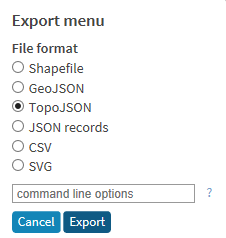

# Creating a World Map with Shape Maps
This write up describes how to create a world map visual in Power BI using the shape maps feature.

## Creating the TopoJSON File
Natural Earth Data hosts a ton of freely available geographic shape files.  For the purposes of this demo I chose the small scale data set that they have here,

https://www.naturalearthdata.com/downloads/110m-cultural-vectors/

Under Admin 0 – Countries, click on the “Download Countries” link.

After downloading, extract the zip file.  You’ll then want to upload the dbf, prj and shp file to mapshaper.org.  You can then export that geography to a TopoJSON format which is the format you need to use the Power BI Shape Map visual.

## Creating the Custom Shape Map Visual
First you need data that maps to the specific TopoJSON shape file.  For this example I’m going to use the Enter Data feature in Power BI to quickly add a new table with some mock country data. 

Now we want to create the Shape Map visual.  First make sure that you have enabled the Shape Map visual in the preview options (as of Sept 2018 its still in preview).

Now in the report canvas click on the Shape Map visual and then bind your location and color saturation values.  With the sample data set I mapped Country to the Location field and then mapped Value to the Color Saturation field.

Next you want to click on the paint brush format icon and now we want to add a custom map layer.  Click “Add Map” and then select the TopoJSON file that we exported from mapshaper.org.  

Once imported your Shape Map visual should now be rendering the world map with the values that were bound to the visual as well. 

